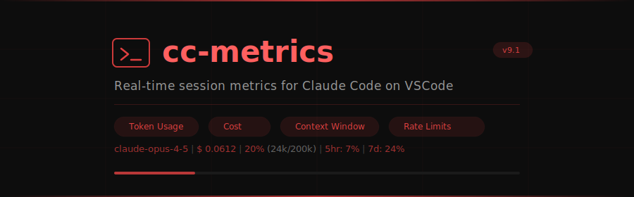
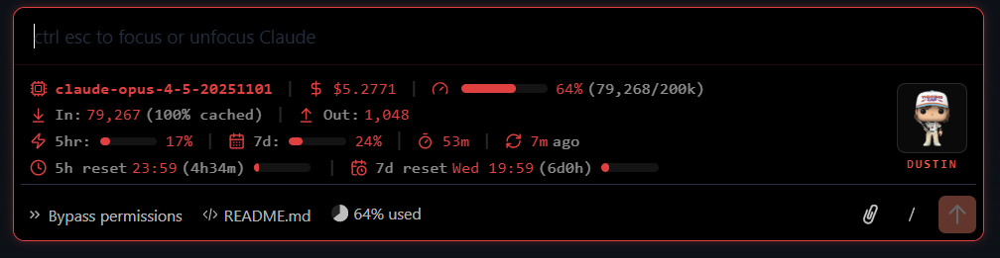

<p align="center">
  
</p>

<p align="center">
  <strong>Real-time session metrics for Claude Code on VSCode</strong>
</p>

<p align="center">
  <a href="#installation"></a>
  <a href="LICENSE"></a>
  <a href="#"></a>
  <a href="#"></a>
</p>

<br />

**cc-metrics** injects a real-time metrics dashboard into the Claude Code VSCode extension chat panel. See your token usage, costs, context window, rate limits, and reset countdowns — all without leaving the conversation.

<p align="center">
  
</p>

---

## Features

| Feature | Description |
|---------|-------------|
| **Model & Cost** | Active model name, cumulative session cost |
| **Context Window** | Used / total tokens with percentage, color-coded progress bar |
| **Token Breakdown** | Input tokens (with cache hit %), output tokens |
| **Rate Limits** | 5-hour and 7-day utilization percentages |
| **Reset Countdowns** | Time remaining until rate limit reset, with visual progress bars |
| **Session Timer** | Elapsed time since session start, last activity indicator |
| **Custom Avatar** | Funko Pop avatar with gradient label (customizable) |
| **Stranger Things Theme** | Red accent palette (`#e04040`) applied across the UI |
| **Lucide SVG Icons** | 12 inline SVG icons — zero external dependencies |

### Metrics Layout

```
┌─────────────────────────────────────────────────────────────┬──────────┐
│  Row 1:  Model  │  $ Cost  │  Context: used/total (%)  bar │          │
│  Row 2:  In: N (cache%)  │  Out: N                        │  Avatar  │
│  Row 3:  5hr: N%  │  7d: N%  │  Session: Xm  │  Last: Xs  │          │
│  Row 4:  5h reset HH:MM (countdown) bar │ 7d reset (cnt)  │          │
└─────────────────────────────────────────────────────────────┴──────────┘
```

---

## Prerequisites

- **VSCode** with Claude Code extension installed
- **Python 3.6+**
- **Linux / macOS / WSL** (tested on WSL2 + Remote SSH)

---

## Installation

### 1. Clone the repository

```bash
git clone https://github.com/longngo192/cc-improve.git
cd cc-improve
```

### 2. Backup the original extension files

> [!IMPORTANT]
> Always create a backup before patching. This allows you to restore the original state at any time.

```bash
python3 src/apply-patches.py backup
```

### 3. Apply the patches

```bash
python3 src/apply-patches.py apply
```

### 4. Reload VSCode

Press `Ctrl+Shift+P` and run **Developer: Reload Window**.

The metrics bar will appear above the input area in the Claude Code chat panel.

---

## Usage

```bash
python3 src/apply-patches.py <command>
```

| Command | Description |
|---------|-------------|
| `apply` | Apply all UI patches (idempotent — safe to run multiple times) |
| `backup` | Backup original extension files to `backups/` |
| `restore` | Restore original files from backup |
| `clean` | Remove patches from the current (beautified) files |
| `verify` | Run 33 checks to confirm all patches are correctly applied |

### Quick Reference

```bash
# First time setup
python3 src/apply-patches.py backup
python3 src/apply-patches.py apply

# After extension update (re-apply patches)
python3 src/apply-patches.py backup
python3 src/apply-patches.py apply

# Revert to original
python3 src/apply-patches.py restore

# Check patch status
python3 src/apply-patches.py verify
```

---

## How It Works

The script patches two files in the Claude Code VSCode extension:

| File | What's Modified |
|------|----------------|
| `webview/index.js` | Injects `CC_MetricsBar` Preact component with signal-based reactivity |
| `webview/index.css` | Adds Stranger Things color palette + metrics bar styles |

**Key technical details:**

- Uses Preact's `_Z()` signal system for reactive updates (same as the extension itself)
- Reads `usageData`, `currentMainLoopModel`, and `utilization` signals directly
- Zero external dependencies — all icons are inline SVG, avatar is base64-embedded
- Patches are idempotent: running `apply` on an already-patched extension safely skips

---

## Customization

<details>
<summary><strong>Change the accent color</strong></summary>

Edit `src/apply-patches.py` and find:

```python
var _ccAccent = "#e04040";
```

Replace `#e04040` with your preferred color. The CSS palette variables are in the `_CSS_PATCH` section near the bottom of the file.

</details>

<details>
<summary><strong>Replace the avatar</strong></summary>

1. Prepare a 128x128 PNG image
2. Convert to base64:
   ```bash
   base64 -w 0 your-avatar.png > assets/dustin_128.b64
   ```
3. Re-apply patches:
   ```bash
   python3 src/apply-patches.py clean
   python3 src/apply-patches.py apply
   ```

</details>

<details>
<summary><strong>Hide specific metric rows</strong></summary>

In `src/apply-patches.py`, find the `CC_MetricsBar` component template. Each row is clearly labeled (`Row1`, `Row2`, `Row3`, `Row4`). Comment out or remove the rows you don't need.

</details>

---

## Troubleshooting

<details>
<summary><strong>Extension not found</strong></summary>

The script auto-detects the extension at:
- `~/.vscode-server/extensions/anthropic.claude-code-*` (Remote/WSL)
- `~/.vscode/extensions/anthropic.claude-code-*` (Local)

If your extension is elsewhere, set the environment variable:

```bash
CC_EXT_DIR=/path/to/anthropic.claude-code-x.x.x python3 src/apply-patches.py apply
```

</details>

<details>
<summary><strong>Patches not visible after reload</strong></summary>

1. Run `python3 src/apply-patches.py verify` to check patch status
2. Make sure you reloaded VSCode (**Developer: Reload Window**)
3. Open a new Claude Code chat session

</details>

<details>
<summary><strong>Extension updated — patches gone</strong></summary>

VSCode extension updates replace the patched files. Simply re-run:

```bash
python3 src/apply-patches.py backup   # backup new version
python3 src/apply-patches.py apply    # re-apply patches
```

</details>

<details>
<summary><strong>Want to revert everything</strong></summary>

```bash
python3 src/apply-patches.py restore
```

This restores the original extension files from your backup.

</details>

---

## Project Structure

```
cc-improve/
├── README.md              # This file
├── LICENSE                 # MIT License
├── .gitignore
├── assets/
│   ├── banner.svg         # Project banner
│   ├── screenshot.png     # UI screenshot (add your own)
│   └── dustin_128.b64     # Avatar image (base64)
├── src/
│   └── apply-patches.py   # Main patching script (all-in-one)
└── backups/               # Created by `backup` command (gitignored)
```

---

## Disclaimer

> [!WARNING]
> This tool modifies proprietary Anthropic extension files. Patches will be overwritten when the extension updates. Use at your own risk. This project is not affiliated with or endorsed by Anthropic.

---

## License

[MIT](LICENSE) - do whatever you want with it.
